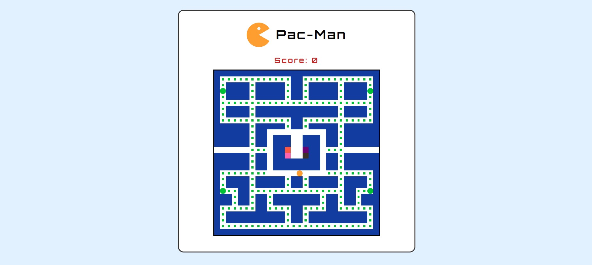

# Pac-man Game
* Reach 274 points and win the game.
    - Pac dots: 1 point
    - Power pellets: 10 points  
    Power pellets scare the ghost for 10 seconds. Scared ghosts turn into gray. They can be eaten by pac-man during this time period.
    - Scared ghosts: 100 points  
    Be sure if the ghosts are scared. Otherwise, pac-man can be destroyed by unscared ghosts.
      
